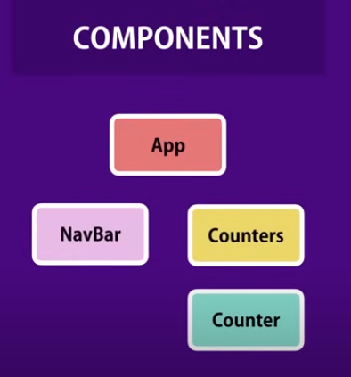

# React-Tutorial by Mosh

# Shortcuts

-   Ctrl + D ---> MultiCursor
-   Ctrl + p ---> Go to file
-   Ctrl + Shift + p --> Open a file
-   Ctrl + , --> Settings in VS
-   Ctrl + Shift + R --> Refactor to create method
-   Ctrl + Alt + down -> copy line down

## From Simple React Snippets

| Snippet | Renders                          |
| ------- | -------------------------------- |
| ccc     | Class Component With Constructor |
| cc      | Class Component                  |
| cdc     | componentDidCatch                |
| cdm     | componentDidMount                |
| cdu     | componentDidUpdate               |
| cp      | Context Provider                 |
| cpf     | Class Property Function          |
| cpc     | Class Pure Component             |
| cwm     | componentWillMount               |
| cwrp    | componentWillReceiveProps        |
| cwu     | componentWillUpdate              |
| cwun    | componentWillUnmount             |
| ffc     | Function Component               |
| gds     | getDerivedStateFromProps         |
| gsbu    | getSnapshotBeforeUpdate          |
| hoc     | Higher Order Component           |
| impc    | Import React / PureComponent     |
| imrd    | Import ReactDOM                  |
| imrc    | Import React / Component         |
| imr     | Import React                     |
| imrs    | Import React / useState          |

# Notes

-   By convention we put all our components under src -> components
-   `<h1>Hello World</h1>` this is a jsx expression, these get compiled to React.createekement(...) but with bable we get this done auto matically
-   `<h1>Hello World</h1><button>Increment</button>` -> Bable doesnt know how to compile this so we need to surround into a div, or `<React.Fragment>
-   JSX Prittier Fix -> Add this to setting file:
    ```json
    "[javascriptreact]": {
    "editor.defaultFormatter": "esbenp.prettier-vscode"
    }
    ```
-   Dynamically display a value: `state = { };`
-   State a special propertie whcih is an object that contains data that a coponent needs.
-   Now to render that we use this notation `<span>{}</span>` where we can include any js expression within the brackts

```JavaScript
import React, { Component } from "react";

class Counter extends Component {
    state = { count: 0 };
    render() {
        return (
            <React.Fragment>
                <span>{this.state.count}</span>
                <button>Increment</button>
            </React.Fragment>
        );
    }
}

export default Counter;
```

# UPDATE

## Common Practices in Modern React Development

1. **Functional Components and Hooks**: Embrace functional components and React Hooks for writing clean and concise code.

2. **Single Responsibility Principle (SRP)**: Design components with a single responsibility to improve maintainability and reusability.

3. **State Management**: Use libraries like Redux, Context API, or Recoil for global state management, and keep state centralized and normalized.

4. **Immutability**: Update state and props immutably to prevent unintended side effects and enhance performance.

5. **Declarative Programming**: Write code in a declarative manner to describe what should happen rather than how to achieve it.

6. **Error Handling**: Implement error boundaries using `ErrorBoundary` components to handle errors gracefully.

7. **Code Splitting**: Split your application into smaller chunks to reduce initial loading time using techniques like dynamic imports.

8. **Performance Optimization**: Minimize re-renders, memoize components with `React.memo`, and profile your application for performance bottlenecks.

9. **CSS-in-JS**: Consider using CSS-in-JS solutions like Styled Components or Emotion for scoped and maintainable styling.

10. **Type Safety**: Utilize TypeScript or PropTypes for type checking to catch errors early and improve code maintainability.

11. **Testing**: Write comprehensive unit tests using libraries like Jest and React Testing Library to ensure code reliability.

12. **Accessibility**: Follow web accessibility guidelines and test your application with screen readers and assistive technologies.

## Functional Based Components

Functional components are a type of component in React that are defined using JavaScript functions rather than ES6 classes. They are also known as stateless components or presentational components. Functional components are simple and concise, making them easier to read and write compared to class components.

### Example

```javascript
import React from "react";

const FunctionalComponent = () => {
    return (
        <div>
            <h1>Hello, Functional Component!</h1>
            <p>This is a simple functional component in React.</p>
        </div>
    );
};

export default FunctionalComponent;
```

## Functional Component Explanation

In this example:

-   The `FunctionalComponent` is defined as an arrow function. It takes no parameters and returns JSX, which represents the UI of the component.
-   The JSX returned by the function represents the structure of the component. It can include HTML-like syntax and React elements.
-   The `FunctionalComponent` function is exported as the default export so it can be imported and used in other parts of the application.

### State and Hooks

Functional components primarily render UI elements and typically don't have their own internal state. However, with the introduction of React Hooks, functional components can now also have state and lifecycle functionality using hooks like `useState`, `useEffect`, and others.

Here's an example of a functional component using state and the `useState` hook:

```javascript
import React, { useState } from "react";

const FunctionalComponentWithState = () => {
    const [count, setCount] = useState(0);

    const incrementCount = () => {
        setCount(count + 1);
    };

    return (
        <div>
            <h1>Functional Component with State</h1>
            <p>Count: {count}</p>
            <button onClick={incrementCount}>Increment</button>
        </div>
    );
};

export default FunctionalComponentWithState;
```

## useState Hook Explanation

In this example:

-   The `useState` hook is used to add state to the functional component. It returns a stateful value (`count`) and a function (`setCount`) to update it.
-   Clicking the "Increment" button calls the `incrementCount` function, which updates the `count` state using `setCount`.

Functional components are a fundamental building block in React applications and are widely used due to their simplicity, reusability, and ease of testing. They are especially useful for presentational components that don't require complex logic or state management.

## Setting Attributes

```JavaScript
    state = { count: 0, imageUrl: "https://picsum.photos/200" };
    
```

-   Editing a class Atribute `<span className="badge text-bg-primary m-2">`

    -   badge text-bg-primary -> give a badge as primary color
    -   m-2 gives a margin of 2

-   Applying Styles

```JavaScript
style = {
        fontSize: 10,
        fontWight: "bold",
    };
<span style={this.style} className="badge text-bg-primary m-2" >

or

<span style={{fontSize: 10}}>
```

## Rendering classes dynamically

```Javascript
let classes = "badge m-2 text-bg-";
classes += this.state.count === 0 ? "warning" : "primary";

<span
                    style={this.style}
                    className={classes}
                >
```

-   Keep things sepret from render method like calculations into a sepereat method

## Render list

```javaScript
state = {
    count: 0,
    // imageUrl: "https://picsum.photos/200",
    tags: ["tag1", "tag2", "tag3"],
};
<ul>
    {this.state.tags.map((tag) => (
        <li key = {tag} >{tag}</li>
    ))}
</ul>
```

-   We add key to make each li element to a unique key ALWAYS!

## Conditional Tags

```javaScript
renderTags() {
    if (this.state.tags.length === 0) return <p>There are no tags!</p>;

    return (
        <ul>
            {this.state.tags.map((tag) => (
                <li key={tag}>{tag}</li>
            ))}
        </ul>
    );
}

or Better

render() {
    return (
        <React.Fragment>
            {this.state.tags.length === 0 && "Please Create new tags!}
        </React.Fragment>
    )
}

```

## Bindign Event Handlers

-   If function is called as a method as part of the object `obj.method` this will always return a refrence to the obj

-   If function is called as a stand alone function `function()` without obj reffrence to the window obj but if strict mode enables it will ret `undefined`
-   We use bind method

```js
constructor() {
        super();
        this.handleIncrement = this.handleIncrement.bind(this);
    }
```

-   in consturctor must always call `super()`
-   All functions behave like obj we have attributes and methods
-   one important one is `bind()`
    -   We pass `this`
    -   bind will return a new instance of the handle increment
-   Another way: Just make the function an arrow function
    -   Arrow functions inherit this

```js
handleIncrement = () => {
    console.log("Increment Clicked", this);
};
```

# Updating State

-   In react we can do the following `this.state.count++` b/c react is not aware of chnages
-   Instead use methods that inherit from Conponent class add this `this.setState()`

```js
handleIncrement = () => {
    this.setState({ count: this.state.count + 1 });
};
```

# What happens when state changes

In React, when a state changes, it triggers a process known as "reconciliation" or "re-rendering." Here's a brief explanation:

1. **State Change**: When the state of a component changes, typically due to user interaction or data updates, React re-renders that component and its children.

2. **Virtual DOM Comparison**: React compares the new Virtual DOM (which reflects the updated state) with the previous Virtual DOM to identify what exactly has changed.

3. **DOM Updates**: React calculates the most efficient way to update the actual DOM based on the differences found in the Virtual DOM comparison. It only applies the necessary changes to the real DOM, minimizing performance overhead.

4. **Component Lifecycle Methods**: During this process, React component lifecycle methods such as `componentWillUpdate()` and `componentDidUpdate()` are invoked, allowing developers to perform additional actions before or after the re-rendering.

5. **Render**: Finally, the component's `render()` method is called again with the updated state, generating a new Virtual DOM representation.

By efficiently updating only the necessary parts of the DOM, React optimizes performance and ensures a smooth user experience.

# Passing Event Arguments

-   We know that when we set an event listiner like `onClick()` we have to pass a function refrence
    Could do this:

```js
    handleIncrement = (product) => {
        console.log(product);
        this.setState({ count: this.state.count + 1 });
    };

    doHandleIncrement = () => {
        this.handleIncrement({ id: 1 });
    };

    render() {
        return (
            <React.Fragment>
                {/*  */}
                <span
                    style={this.style}
                    className={this.getBadgeClasses()}
                >
                    {this.formatCount()}
                </span>
                <button
                    onClick={this.doHandleIncrement}
                    className="btn btn-secondary btn-sm"
                >
```

Instead do this

```js
 <button
                    onClick={() => {
                        this.handleIncrement({ id: 1 });
                    }}
                    className="btn btn-secondary btn-sm"
                >
```

# Composiong Components

# Passing data to Components

-   Every react components has a property named `props`
-   its a plain js obj that includes all attrobutes like

```js
<Counter
    key={counter.id}
    value={counter.value}
    selected={true}
/>
```

-   `console.log("props", this.props);`
-   so we can init our counter to

```js
state = {
    count: this.props.value,
};
```

```js
<Counter
    key={counter.id}
    value={counter.value}
    selected
/>
```

-   We dont have to give any value to selected it will auto be true

## Passing Children

-   Sometims we may want to pass info between a tag like:

```js

// In Counters
<Counter
    key={counter.id}
    value={counter.value}
    selected={true}
>
    <h4>Title</h4>
</Counter>


// in Counter
   render() {
        console.log("props", this.props);

        return (
            <div>
                {this.props.children}
                {/*  */}
                <span
                    // style={this.style}
                    className={this.getBadgeClasses()}
                >
                    {this.formatCount()}
                </span>
                <button
                    onClick={() => {
                        this.handleIncrement({ id: 1 });
                    }}
                    className="btn btn-secondary btn-sm"
                >
                    Increment
                </button>
                {/* {this.renderTags()} */}
                {/* {this.state.tags.length === 0 && "Please add Tags!"} */}
            </div>
        );
    }
```

# Raising and Handling Eevents

-   The component that owns a piece of the state, should be the one modyfying it.
    -   Therefre adding or removing a counter should be handled in counters


-   so in our case we will have our delete button in counter but it will Raise an event in the counters copmonent
    -   Name convention `onDelete` in counter
    -   `handleDelete()` in Counters

```js
import React, { Component } from "react";
import Counter from "./counter";

class Counters extends Component {
    state = {
        counters: [
            { id: 1, value: 0 },
            { id: 2, value: 0 },
            { id: 3, value: 0 },
            { id: 4, value: 0 },
        ],
    };

    handleDelete = () => {
        console.log("event Handler Called");
    };

    render() {
        return (
            <div>
                {this.state.counters.map((counter) => (
                    <Counter
                        key={counter.id}
                        value={counter.value}
                        selected={true}
                        onDelete={this.handleDelete}
                    >
                        <h4>Counter#{counter.id}</h4>
                    </Counter>
                ))}
            </div>
        );
    }
}

export default Counters;
```

-   Here we are passing a refrence of our `handleDelete` function to counter.

```js
class Counter extends Component {
    state = {
        value: this.props.value,
    };

    render() {

        return (
            <div>
                <button
                    className="btn btn-danger btn-sm m-2"
                    onClick={this.props.onDelete}
                >
                    Delete
                </button>
        )
    }
```

# Updating a state

### Counters:

-   In order to pass info we will inlcude param `handleDelete = (counterId) => {};`
-   Now to delete we do not update state diectly weill not remove counter in curr array, Instead create new array and call `setState()` method.

```js
state = {
    counters: [
        { id: 1, value: 0 },
        { id: 2, value: 0 },
        { id: 3, value: 0 },
        { id: 4, value: 0 },
    ],
};

handleDelete = (counterId) => {
    const counters = this.state.counters.filter((c) => c.id !== counterId);
    this.setState({ counters: counters });
};

// since counters: is same as counters we can simplify
handleDelete = (counterId) => {
    const counters = this.state.counters.filter((c) => c.id !== counterId);
    this.setState({ counters });
};
```

-   We use filter method to filter out the one with the id we dont want.

### Counter:

```js
<button
    className="btn btn-danger btn-sm m-2"
    onClick={() => this.props.onDelete(this.props.id)}
>
    Delete
</button>
```

-   Instead of passing each property we add to counter seperetly we can send the entire counter obj

```js
    render() {
        return (
            <div>
                {this.state.counters.map((counter) => (
                    <Counter
                        key={counter.id}
                        value={counter.value}
                        selected={true}
                        onDelete={this.handleDelete}
                        id={counter.id}
                    />
                ))}
            </div>
        );
    }

    state = {
        counters: [
            { id: 1, value: 0 },
            { id: 2, value: 0 },
            { id: 3, value: 0 },
            { id: 4, value: 0 },
        ],
    };
    render() {
        return (
            <div>
                {this.state.counters.map((counter) => (
                    <Counter
                        key={counter.id}
                        onDelete={this.handleDelete}
                        counter = {counter}
                    />
                ))}
            </div>
        );
    }

```

# Single source of truth

-   When hitting rest each components has its own local state our counters has array of counters and each counter componet has a value currently disconnected from each counter object that we have in array of counters.

### Counters:

```js
handleReset = () => {
    const counters = this.state.counters.map((c) => {
        c.value = 0;
        return c;
    });

    this.setState(counters);
};
```

### Counter:

```js
state = {
    value: this.props.counter.value,
};
```

-   This code exec only once wwhen instance of counter created
-   We can increment b/c handleIncrement is dealing directly witrh local state
    
-   remove the lccal state in counter component and have single source of truth
    

# Removing local state


-   We want to remove local state and only realy on props of data recieved
-   this is called a controlled compnenet is recives all data via props aand raises events when data need be changed
-   Components entriely controlled by parent
-   Deleete all state from counter
-   find everything that refrences state and use props
-   Remove `handleIncrement`
-   Now insead of calling `onClick={this.handleIncrement}`
-   Do same as we did for delete `onClick={this.props.onDelete(this.props.copunter.id)}`

### Use Spread Operator

-   Use spread operator to clone `this.state.counters`

```js
handleIncrement = (counter) => {
    const counters = [...this.state.counters];
};

// We also create a new object counter for the counter we got passed b/c we dont want to directly mod the state
handleIncrement = (counter) => {
    const counters = [...this.state.counters];
    counters[0] = { ...counter };
    counters[0].value++;
};

// Now to not hardcode index
handleIncrement = (counter) => {
    const counters = [...this.state.counters];
    const index = counters.indexOf(counter);
    counters[index] = { ...counter };
    counters[index].value++;
};

// now updating the state
handleIncrement = (counter) => {
    const counters = [...this.state.counters];
    const index = counters.indexOf(counter);
    counters[index] = { ...counter };
    counters[index].value++;
    this.setState({ counters });
};
```

# Multiple components in sync

### currently we have


```js
import React from "react";
import ReactDOM from "react-dom/client";
import "./index.css";
import App from "./App";
import reportWebVitals from "./reportWebVitals";
import "bootstrap/dist/css/bootstrap.css";
import Counters from "./components/counters";

const root = ReactDOM.createRoot(document.getElementById("root"));
root.render(
    <React.StrictMode>
        <Counters />
    </React.StrictMode>
);
```

### wwe want



```js
import React from "react";
import ReactDOM from "react-dom/client";
import "./index.css";
import App from "./App";
import reportWebVitals from "./reportWebVitals";
import "bootstrap/dist/css/bootstrap.css";
import Counters from "./components/counters";

const root = ReactDOM.createRoot(document.getElementById("root"));
root.render(
    <React.StrictMode>
        <App />
    </React.StrictMode>
);

// If you want to start measuring performance in your app, pass a function
// to log results (for example: reportWebVitals(console.log))
// or send to an analytics endpoint. Learn more: https://bit.ly/CRA-vitals
reportWebVitals();
```

-   In `App.js` We want to replace regualr code with bootstrap template

```js
import logo from "./logo.svg";
import "./App.css";

function App() {
    return (
        <div className="App">
            <header className="App-header">
                
                <p>
                    Edit <code>src/App.js</code> and save to reload.
                </p>
                <a
                    className="App-link"
                    href="https://reactjs.org"
                    target="_blank"
                    rel="noopener noreferrer"
                >
                    Learn React
                </a>
            </header>
        </div>
    );
}

export default App;
```

-   Now go to [Bootstrap Examples](https://getbootstrap.com/docs/5.3/examples/)
-   Click on one template and right click and click `view page source` copy the contenet you want
-   Create a new file named `navbar.jsx`
-   paste code in render method


-   Notice we can pass counters[] directly as props to counter b/c its our child
-   WHen no parent child relationship and we want to sync info between neighbors we need to lift the state up.
    
    
-   Now bot habe access

## Lift State

-   From counters get the state and any methods that mod the state Move to parent in `App.js`
-   Now we dont have access to some stuff like handles

```js
<div>
    <button
        onClick={this.handleReset}
        className="btn btn-primary btn-sm m2"
    >
        Reset
    </button>
    {this.state.counters.map((counter) => (
        <Counter
            key={counter.id}
            onDelete={this.handleDelete}
            onIncrement={this.handleIncrement}
            counter={counter}
        />
    ))}
</div>
```

-   This is inn counters
-   so we have to pass it down from parent using props

```js

import React, { Component } from 'react';
import NavBar from './components/navbar';
import Counters from './components/counters';
import './App.css';

function App() {
  state = {
    counters: [
        { id: 1, value: 0 },
        { id: 2, value: 0 },
        { id: 3, value: 0 },
        { id: 4, value: 0 },
    ],
  };

  handleDelete = (counterId) => {
      const counters = this.state.counters.filter((c) => c.id !== counterId);
      this.setState({ counters });
  };

  handleIncrement = (counter) => {
      const counters = [...this.state.counters];
      const index = counters.indexOf(counter);
      counters[index] = { ...counter };
      counters[index].value++;
      this.setState({ counters });
  };

  handleReset = () => {
      const counters = this.state.counters.map((c) => {
          c.value = 0;
          return c;
      });

      this.setState(counters);
  };

  return (
    <React.Fragment>
      <NavBar/>
      <main className="container">
        <Counters onReset={this.handleReset/>
        <Counters onIncrement={this.handleIncrement/>
        <Counters onDelete={this.handleDelete/>
      </main>
    </React.Fragment>

  );
}

export default App;
```

-   Now we hjabe 3 event raised on coponents and coresponing handles
-   raise event the `on` mehtiods

```js
import React, { Component } from "react";
import Counter from "./counter";

class Counters extends Component {
    render() {
        return (
            <div>
                <button
                    onClick={this.props.onReset}
                    className="btn btn-primary btn-sm m2"
                >
                    Reset
                </button>
                {this.state.counters.map((counter) => (
                    <Counter
                        key={counter.id}
                        onDelete={this.onDelete}
                        onIncrement={this.onIncrement}
                        counter={counter}
                    />
                ))}
            </div>
        );
    }
}

export default Counters;
```

-   Now we have this in counters
