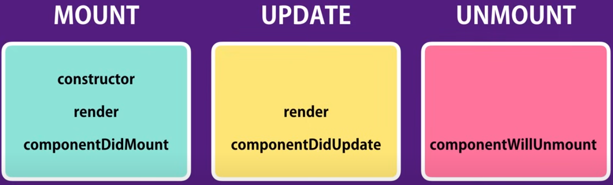

# Getting Started with Create React App

This project was bootstrapped with [Create React App](https://github.com/facebook/create-react-app).

## Available Scripts

In the project directory, you can run:

### `npm start`

Runs the app in the development mode.\
Open [http://localhost:3000](http://localhost:3000) to view it in your browser.

The page will reload when you make changes.\
You may also see any lint errors in the console.

### `npm test`

Launches the test runner in the interactive watch mode.\
See the section about [running tests](https://facebook.github.io/create-react-app/docs/running-tests) for more information.

### `npm run build`

Builds the app for production to the `build` folder.\
It correctly bundles React in production mode and optimizes the build for the best performance.

The build is minified and the filenames include the hashes.\
Your app is ready to be deployed!

See the section about [deployment](https://facebook.github.io/create-react-app/docs/deployment) for more information.

### `npm run eject`

**Note: this is a one-way operation. Once you `eject`, you can't go back!**

If you aren't satisfied with the build tool and configuration choices, you can `eject` at any time. This command will remove the single build dependency from your project.

Instead, it will copy all the configuration files and the transitive dependencies (webpack, Babel, ESLint, etc) right into your project so you have full control over them. All of the commands except `eject` will still work, but they will point to the copied scripts so you can tweak them. At this point you're on your own.

You don't have to ever use `eject`. The curated feature set is suitable for small and middle deployments, and you shouldn't feel obligated to use this feature. However we understand that this tool wouldn't be useful if you couldn't customize it when you are ready for it.

## Learn More

You can learn more in the [Create React App documentation](https://facebook.github.io/create-react-app/docs/getting-started).

To learn React, check out the [React documentation](https://reactjs.org/).

### Code Splitting

This section has moved here: [https://facebook.github.io/create-react-app/docs/code-splitting](https://facebook.github.io/create-react-app/docs/code-splitting)

### Analyzing the Bundle Size

This section has moved here: [https://facebook.github.io/create-react-app/docs/analyzing-the-bundle-size](https://facebook.github.io/create-react-app/docs/analyzing-the-bundle-size)

### Making a Progressive Web App

This section has moved here: [https://facebook.github.io/create-react-app/docs/making-a-progressive-web-app](https://facebook.github.io/create-react-app/docs/making-a-progressive-web-app)

### Advanced Configuration

This section has moved here: [https://facebook.github.io/create-react-app/docs/advanced-configuration](https://facebook.github.io/create-react-app/docs/advanced-configuration)

### Deployment

This section has moved here: [https://facebook.github.io/create-react-app/docs/deployment](https://facebook.github.io/create-react-app/docs/deployment)

### `npm run build` fails to minify

This section has moved here: [https://facebook.github.io/create-react-app/docs/troubleshooting#npm-run-build-fails-to-minify](https://facebook.github.io/create-react-app/docs/troubleshooting#npm-run-build-fails-to-minify)

## SFC

```js
import React from "react";

// SFC - Stateless Functional Coponent
const NavBar = (props) => {
    return (
        <nav class="navbar bg-body-tertiary">
            <div class="container-fluid">
                <span class="navbar-brand mb-0 h1">
                    Navbar{" "}
                    <button
                        type="button"
                        class="btn btn-primary"
                    >
                        Notifications{" "}
                        <span class="badge text-bg-secondary">
                            {this.props.totalCounters}
                        </span>
                    </button>
                </span>
            </div>
        </nav>
    );
};

export default NavBar;
```

-   When copnonetdoesnt have state or methods only have render

## Destructoring Arguments

```js
const NavBar = ({ totalCounters }) => {
    return (
        <nav class="navbar bg-body-tertiary">
            <div class="container-fluid">
                <span class="navbar-brand mb-0 h1">
                    Navbar{" "}
                    <button
                        type="button"
                        class="btn btn-primary"
                    >
                        Notifications{" "}
                        <span class="badge text-bg-secondary">
                            {totalCounters}
                        </span>
                    </button>
                </span>
            </div>
        </nav>
    );
};
```

-   We can simplify this by destructuing the props and getting the property we want

### Another example

```js
import React, { Component } from "react";
import Counter from "./counter";

class Counters extends Component {
    render() {
        const { onIncrement, onDelete, onReset, counters } = this.props;

        return (
            <div>
                <button
                    onClick={onReset}
                    className="btn btn-primary btn-sm m2"
                >
                    Reset
                </button>
                {counters.map((counter) => (
                    <Counter
                        key={counter.id}
                        onDelete={onDelete}
                        onIncrement={onIncrement}
                        counter={counter}
                    />
                ))}
            </div>
        );
    }
}

export default Counters;
```

## Lifecylce Hooks


Lifecycle hooks, also known as lifecycle methods or lifecycle functions, are special methods in React class components that are invoked at specific points during the lifecycle of a component. These hooks allow developers to perform actions or execute code at various stages of a component's existence, from its creation to its removal from the DOM.

### Mounting Phase

-   `constructor()`: Called when a component is initialized, before it is mounted to the DOM. It's typically used for initializing state and binding event handlers.
-   `componentDidMount()`: Called after a component is mounted to the DOM. It's commonly used for tasks such as fetching data from APIs, initializing third-party libraries, or setting up event listeners.

### Updating Phase

-   `static getDerivedStateFromProps()`: Called before rendering when new props are received. It's used to update the component's state based on changes in props.
-   `shouldComponentUpdate()`: Called before rendering when new props or state are received. It determines whether the component should re-render or not, based on changes in props or state.
-   `render()`: Called to render the component's UI. It returns the React elements to be rendered.
-   `getSnapshotBeforeUpdate()`: Called right before changes from the Virtual DOM are reflected in the DOM. It's used to capture some information from the DOM before it's potentially changed (e.g., scrolling position).
-   `componentDidUpdate()`: Called after the component's updates are reflected in the DOM. It's used for performing actions after a component has been updated, such as fetching new data based on changes.

### Unmounting Phase

-   `componentWillUnmount()`: Called immediately before a component is unmounted from the DOM. It's used for cleanup tasks such as removing event listeners or cancelling network requests.

These lifecycle hooks provide developers with control over different stages of a component's life, allowing them to manage state, perform side effects, and optimize performance effectively. However, with the introduction of React Hooks in functional components, the usage of class-based lifecycle hooks has become less common in modern React applications.

## Mounting Phase:

```js
class App extends Coponent {
    state = {};

    constructor(props) {
        super(props);
        consol.log("App");
        this.state = this.props.someProperty;
    }

    conponentDidMount() {}
}
```

-   Called once, an instance of class is initiatd and object created
-   good oportunity to initialize any state valiables
    -   USually with ones that get passed in

`componentDidMount()` is a lifecycle method in React class components. It is called automatically by React when a component is rendered for the first time and added to the DOM (Document Object Model).

This method is commonly used for tasks that need to be performed after the component has been mounted and rendered on the screen. Some typical use cases for `componentDidMount()` include:

1. Fetching data from an external API.
2. Initializing third-party libraries or plugins.
3. Setting up event listeners.
4. Performing any necessary DOM manipulations.

Here's an example of how `componentDidMount()` might be used:

```javascript
class MyComponent extends React.Component {
    componentDidMount() {
        // Fetch data from an API
        fetch("https://api.example.com/data")
            .then((response) => response.json())
            .then((data) => {
                // Update component state with fetched data
                this.setState({ data });
            })
            .catch((error) => {
                console.error("Error fetching data:", error);
            });

        // Initialize a third-party library
        ThirdPartyLibrary.initialize();

        // Add event listener
        window.addEventListener("scroll", this.handleScroll);
    }

    componentWillUnmount() {
        // Remove event listener to avoid memory leaks
        window.removeEventListener("scroll", this.handleScroll);
    }

    handleScroll() {
        // Handle scroll event
    }

    render() {
        return <div>{/* Render component content */}</div>;
    }
}
```

In this example:

-   `componentDidMount()` is used to fetch data from an API, initialize a third-party library, and add an event listener for scrolling.
-   `componentWillUnmount()` is used to clean up by removing the event listener when the component is unmounted, preventing memory leaks.
-   The `render()` method renders the component's content, which will be displayed on the screen.
